# LeadHunter — Buscando 1 Milhão potencializado

**SDR autônomo que encontra, qualifica e aborda clientes e afiliados no Instagram e na web, sem entregar seus dados para uma plataforma externa.**

O LeadHunter faz tudo que o prompt original [Buscando 1 Milhão](docs/reference/buscandomilhao.md) pedia — descoberta no Instagram, primeira DM pelo seu próprio Chrome, continuação pela API oficial da Meta, motor de conversa que só afirma o que está comprovado, dois funis (clientes e afiliados), experimentos, CRM e pausa automática — somado ao que já fazia antes: descoberta por site, CSV e OpenStreetMap, crawler com evidência citada, score determinístico, supressão global e dry-run por padrão.

Roda local, em um comando, com SQLite. Nada sai da máquina sem você ligar explicitamente.

## O ciclo

```mermaid
flowchart LR
    A[Negócio + ICP + claims] --> B[Campanha: clientes ou afiliados]
    B --> C[Descobrir: Instagram, site, CSV, OSM]
    C --> D[Deduplicar + enriquecer + score]
    D --> E[1ª DM pelo seu Chrome, ritmo humano]
    E --> F[Lead responde → webhook da Meta]
    F --> G[Conversa pela API oficial: intenção → ação → resposta]
    G --> H[WhatsApp ou grupo de afiliados]
    H --> I[Medir por variante → rebalancear → adaptar]
```



Tudo isso é um job durável no SQLite; o worker recupera o que ficou no meio depois de reiniciar.

## O que ele faz

**Descoberta.** Instagram (busca por palavra-chave e páginas de hashtag, lendo só perfis públicos), sites informados, CSV com mapeamento de colunas, OpenStreetMap/Overpass e Google Places (opcional). Um lead só; várias fontes ficam registradas nele. Dedupe por handle, domínio, e-mail, telefone, URL e nome+cidade.

**Qualificação.** Score 0–100 e confiança separada, com explicação auditável. Do perfil do Instagram entram bio, números e sinais (WhatsApp na bio, site no perfil, vende pelo direct) e quem responde: dono, loja ou funcionário. Se o perfil tem site, o crawler entra e a evidência do site soma.

**Primeiro contato pelo navegador.** Playwright conectado ao **seu** Chrome por CDP: perfil dedicado, sessão logada por você uma vez, aba própria do agente, nunca rouba foco, só `instagram.com`, fecha a aba mesmo em erro, guarda screenshot e snapshot de acessibilidade quando falha. Ritmo humano: 30 DMs/dia no teto, 90–240 s entre elas, 09:00–20:00, aquecimento de 5/dia na primeira semana subindo 5 por semana. Nada de fingerprint forjado, API privada ou contorno de restrição: um alerta do Instagram **pausa tudo**.

**Continuação pela API oficial.** O webhook da Meta recebe a resposta, o sistema casa o IGSID com o lead e a propriedade do canal passa para a API. A partir daí o navegador nunca mais responde aquele fio, e a API só envia com janela de 24 h aberta. Uma trava impede envio duplicado.

**Motor de conversa.** Intenções (`interested`, `asked_pricing`, `wants_whatsapp`, `not_the_owner`, `opt_out`…) → ações → resposta. Funciona sem IA, com regras; com um endpoint compatível com OpenAI, classifica e redige, mas toda resposta passa pelo filtro de **afirmações verificadas**: o que está em "a comprovar" ou "proibido" não sai, nem parafraseado. Pedido de parar é atendido na hora e vale para sempre, em todos os canais.

**Dois funis.** Clientes vão para o link do WhatsApp; criadores vão para o grupo de afiliados. Pipelines e estados de canal são campos separados, como no prompt.

**Experimentos.** Duas variantes de abertura por funil, sorteio por peso, atribuição fixa por lead, métricas por variante (enviadas, responderam, interessados, encaminhados) e rebalanceamento automático com piso de exploração de 20%, só depois de 30 envios por variante.

**Autopilot.** A cada 5 minutos: descobre se está abaixo da meta, manda uma DM se o ritmo permite, agenda follow-ups, rebalanceia uma vez por dia. Respeita a pausa geral, os limites e a janela de operação. Desligado por padrão.

**CRM.** Visão geral com DMs do dia, respostas, encaminhados, custo de IA por lead e por cliente; funil em kanban por tipo; conversas com linha do tempo (mensagens, decisões da IA, canal); fila de exceções; experimentos; página do Instagram com estado do Chrome, ritmo do dia e botão de pausa.

**Segurança.** Segredos só no `.env`; perfil do Chrome e banco fora do Git; assinatura do webhook verificada; idempotência de webhook e job; retry com limite e dead-letter; orçamento mensal de IA que pausa a IA; circuit breaker de 3 falhas do navegador; pausa manual e automática.

## Rodando

```bash
git clone https://github.com/thallisribeiro/leadhunter.git
cd leadhunter
pnpm install
cp .env.example .env        # PowerShell: Copy-Item .env.example .env
pnpm db:migrate
pnpm dev                    # web + worker em http://localhost:3000
```

Sem nenhuma credencial você já consegue: onboarding, campanhas, CSV, OpenStreetMap, crawl, score, shortlist, rascunhos, dry-run de DM e de e-mail, funil, experimentos.

## Ligando o Instagram, na ordem certa

1. **Chrome dedicado** com porta de debug em `127.0.0.1` (comandos em [SETUP.md](SETUP.md)). Faça login no Instagram uma vez, na mão.
2. **Dry-run.** `INSTAGRAM_DM_ENABLED=false` (padrão). Rode uma campanha com fonte Instagram: as DMs ficam gravadas em Conversas sem sair.
3. **Piloto.** Revise os textos, ligue `INSTAGRAM_DM_ENABLED=true`. O aquecimento começa em 5 por dia.
4. **API oficial.** App da Meta com webhook em `/api/webhooks/instagram`, `INSTAGRAM_APP_SECRET`, `INSTAGRAM_PAGE_ACCESS_TOKEN`, `INSTAGRAM_WEBHOOK_VERIFY_TOKEN`.
5. **Autonomia.** `AUTOPILOT_ENABLED=true`.

Para desligar tudo agora: botão "Pausar tudo" em Instagram, ou `AUTOPILOT_ENABLED=false` + `INSTAGRAM_DM_ENABLED=false` e reiniciar.

## Demonstração offline

```bash
pnpm db:seed
LEADHUNTER_FIXTURE_MODE=true pnpm dev
```

Em modo fixture o "Instagram" é uma simulação em memória (`src/integrations/browser/fake.ts`): a descoberta, o score, a mensagem de abertura, o dry-run e o funil rodam de ponta a ponta sem tocar em conta nenhuma.

## Comandos

| Comando | O que faz |
|---|---|
| `pnpm dev` / `pnpm start` | web + worker |
| `pnpm db:migrate` | aplica as migrações (idempotente) |
| `pnpm db:seed` | demo com 20 clínicas fictícias |
| `pnpm db:backup` | backup consistente em `backups/` |
| `pnpm lint` · `pnpm typecheck` · `pnpm test` | qualidade |
| `pnpm test:e2e` | build + fluxo completo no navegador |
| `pnpm smoke:real` | Overpass e uma URL pública de verdade |

## Arquitetura

```text
src/
  app/                 painel PT-BR, Server Actions, webhook da Meta
  features/
    business/          perfil, ICP, claims (bloco CONFIGURAÇÃO)
    campaigns/         campanha por funil, fontes, hashtags, autopilot
    discovery/         provedores + dedupe + snapshot do Instagram
    enrichment/        crawler limitado + evidência citada
    scoring/           score determinístico + confiança
    instagram/         ritmo/aquecimento, 1ª DM, autopilot
    conversations/     trava de canal, mensagens, motor de conversa
    experiments/       variantes, atribuição, métricas, rebalanceamento
    ops/               pausa geral, circuit breaker, exceções
    outreach/          e-mail (dry-run), supressão, exportação
  integrations/
    browser/           Playwright por CDP no seu Chrome + parser + fake
    instagram/         API oficial da Meta (assinatura, webhook, envio)
    llm/               cliente compatível com OpenAI, orçamento, conversa
    whatsapp/          fila em arquivo para um listener externo
    discovery/, web/, smtp/
  db/                  schema Drizzle, migrações SQL, seed, backup
  worker/              fila durável + jobs + tick do autopilot
```

## Limites que continuam de propósito

- Single-user, local. Sem multi-tenant, sem billing.
- A primeira DM exige o seu Chrome logado; em container ou nuvem o navegador não existe, então a camada roda em dry-run e a simulação, e o smoke real fica documentado para a sua máquina.
- A API da Meta não abre conversa com quem nunca respondeu e fecha a janela em 24 h; o sistema registra e não contorna pelo navegador.
- O DOM do Instagram muda. O parser lê meta tags públicas (mais estáveis) e o clique usa papéis de acessibilidade; quando quebra, 3 falhas seguidas pausam e a fila de exceções mostra o artefato.
- Conformidade legal e base legítima para contato continuam sendo do operador.

## Documentação

- [Setup, Chrome, Meta, operação e troubleshooting](SETUP.md)
- [Plano desta versão](docs/superpowers/plans/2026-09-05-buscando-potencializado.md)
- [Especificação do MVP anterior (só web)](docs/superpowers/specs/2026-09-05-leadhunter-local-design.md)
- [Prompt original: Buscando 1 Milhão](docs/reference/buscandomilhao.md)
