# LeadHunter Local

**Encontre, qualifique e organize potenciais clientes B2B sem entregar seus dados para uma plataforma externa.**

LeadHunter é uma aplicação de prospecção que roda localmente. Você descreve seu negócio e o perfil de cliente ideal; o sistema pesquisa empresas, remove duplicidades, analisa seus sites, registra evidências, calcula um score e prepara abordagens personalizadas para revisão.

O resultado é uma lista priorizada de empresas com contexto suficiente para decidir quem merece contato — não apenas uma planilha cheia de nomes.

> O MVP está funcional, testado e preparado para uso local. Email real permanece desabilitado por padrão.

## Por que existe

Uma busca comercial normalmente exige combinar mapas, planilhas, sites, redes sociais, anotações e ferramentas de IA. Além do trabalho manual, fica difícil responder perguntas básicas:

- Por que este lead foi selecionado?
- De onde veio cada informação?
- Esta empresa já apareceu em outra fonte?
- Existe um contato comercial público?
- O que torna este lead aderente ao meu ICP?
- A abordagem está afirmando algo que pode ser comprovado?

O LeadHunter reúne esse processo em uma operação local, rastreável e orientada por evidências.

## Como funciona

```mermaid
flowchart LR
    A[Definir negócio e ICP] --> B[Criar campanha]
    B --> C[Descobrir empresas]
    C --> D[Deduplicar]
    D --> E[Enriquecer e salvar evidências]
    E --> F[Calcular score e confiança]
    F --> G[Selecionar shortlist]
    G --> H[Gerar e revisar abordagem]
    H --> I[Dry-run, exportação ou envio aprovado]
    I --> J[Registrar resultado]
```



### 1. Configuração do negócio

No onboarding você informa:

- empresa, site, oferta e pitch;
- segmentos, localizações e características do cliente ideal;
- sinais positivos, negativos e exclusões;
- objetivo da abordagem, CTA e tom;
- afirmações verificadas e afirmações proibidas.

Esses dados alimentam a qualificação e limitam o que pode aparecer nas mensagens.

### 2. Campanha de prospecção

Cada campanha define um recorte independente: segmento, região, quantidade desejada, palavras-chave, sinais, score mínimo, idioma e fontes de descoberta.

Exemplo:

```text
Campanha: Dentistas Miami
Segmentos: dentist, dental clinic
Localização: Miami, Florida, USA
Sinal desejado: odontologia estética
Score mínimo: 70
Meta: 200 leads
```

### 3. Descoberta em múltiplas fontes

| Fonte | Credencial | Uso |
|---|---:|---|
| CSV | Não | Importar listas existentes com aliases em português e inglês |
| URLs iniciais | Não | Cadastrar e analisar sites já conhecidos |
| OpenStreetMap / Overpass | Não | Encontrar empresas locais em dados públicos |
| Google Places | Opcional | Ampliar a descoberta quando uma chave estiver configurada |

Quando o cabeçalho do CSV não é reconhecido, a própria interface permite mapear cada coluna antes da importação.

Falha em uma fonte não descarta os resultados das demais.

### 4. Deduplicação

Empresas encontradas em fontes diferentes são consolidadas usando, nesta ordem:

- domínio normalizado;
- email;
- telefone;
- URL canônica;
- nome normalizado combinado com localização.

As fontes originais continuam registradas, permitindo saber onde cada lead foi encontrado.

### 5. Enriquecimento com evidências

O worker visita apenas páginas públicas e extrai informações úteis, como:

- descrição do negócio;
- serviços e sinais comerciais;
- email e telefone;
- Instagram, LinkedIn e outras redes públicas;
- possíveis oportunidades observadas no site.

Cada evidência guarda valor, URL de origem, provedor e data de captura. Quando algo não foi encontrado, a interface informa isso explicitamente.

O crawler possui limites de páginas, redirects, tempo e tamanho de resposta. URLs privadas, localhost, endpoints de metadata e protocolos não HTTP são bloqueados.

### 6. Score e confiança

O score de `0–100` prioriza aderência ao ICP, localização, palavras-chave, contatos disponíveis, presença digital, oportunidades e sinais positivos ou excludentes.

A confiança é calculada separadamente. Um lead pode ter boa aderência, mas baixa confiança quando existem poucas fontes ou evidências.

O perfil mostra:

- score final;
- confiança;
- razões da pontuação;
- oportunidade detectada;
- contatos;
- evidências e links das fontes.

O cálculo principal é determinístico e continua funcionando sem IA configurada.

### 7. Shortlist e outreach

Os melhores leads podem ser selecionados em massa e enviados para a shortlist. A partir dela, o LeadHunter gera drafts de email ligados às evidências reais do lead e às afirmações verificadas do seu negócio.

Antes de qualquer envio, o operador pode revisar e aprovar a mensagem.

### 8. Dry-run e email seguro

O padrão é:

```dotenv
EMAIL_SENDING_ENABLED=false
```

Nesse modo, a tentativa é registrada, mas nenhum email sai da máquina. O envio real exige simultaneamente:

- SMTP configurado;
- `EMAIL_SENDING_ENABLED=true`;
- ação explícita de envio;
- draft aprovado;
- destinatário válido;
- lead fora da suppression list;
- limite diário e intervalo disponíveis;
- chave de idempotência inédita.

Pedidos de não contato criam uma suppression global e permanente.

### 9. Operação e acompanhamento

O workspace inclui:

- visão geral com métricas;
- central de campanhas;
- tabela densa de leads com filtros e ordenação;
- shortlist;
- revisão de abordagens;
- atualização manual de resultados;
- acompanhamento de jobs, tentativas e erros;
- exportação completa em CSV;
- registro de tokens e custo de IA.

Os jobs ficam persistidos no SQLite e podem ser recuperados após reinício do worker.

## Rodando localmente

### Requisitos

- Node.js 24 ou superior;
- pnpm 11 ou superior.

### Instalação

```bash
git clone https://github.com/thallisribeiro/leadhunter.git
cd leadhunter
pnpm install
cp .env.example .env
pnpm db:migrate
pnpm dev
```

No PowerShell, substitua a cópia do `.env` por:

```powershell
Copy-Item .env.example .env
```

Abra [http://localhost:3000](http://localhost:3000). O comando `pnpm dev` inicia a interface e o worker juntos.

## Demonstração com 20 leads

O projeto inclui uma campanha reproduzível com 20 clínicas fictícias de Miami:

```bash
pnpm db:seed
pnpm dev
```

O seed pode ser executado novamente sem duplicar a campanha, os leads, os scores ou os drafts.

## Configuração opcional

Nenhuma credencial é necessária para iniciar, carregar a demo ou executar os testes.

| Integração | Variáveis principais | Necessária? |
|---|---|---:|
| IA compatível com OpenAI | `LLM_API_KEY`, `LLM_MODEL`, `LLM_BASE_URL` | Não |
| Google Places | `GOOGLE_PLACES_API_KEY` | Não |
| SMTP | `SMTP_HOST`, `SMTP_USER`, `SMTP_PASSWORD`, `SMTP_FROM_EMAIL` | Apenas para envio real |

O arquivo [.env.example](.env.example) contém todas as opções e limites disponíveis.

## Comandos úteis

| Comando | O que faz |
|---|---|
| `pnpm dev` | Inicia web e worker em desenvolvimento |
| `pnpm build` | Gera o build de produção |
| `pnpm start` | Inicia web e worker em produção |
| `pnpm db:migrate` | Aplica as migrations SQLite |
| `pnpm db:seed` | Carrega a demo idempotente de 20 leads |
| `pnpm db:backup` | Cria um backup consistente em `backups/` |
| `pnpm lint` | Executa o ESLint |
| `pnpm typecheck` | Valida o TypeScript estrito |
| `pnpm test` | Executa testes unitários e de integração |
| `pnpm test:e2e` | Gera o build e executa o fluxo completo no navegador |
| `pnpm smoke:real` | Testa Overpass e uma URL pública com rede real |

## Arquitetura

```text
src/
  app/            interface, páginas, Server Actions e endpoints
  components/     componentes visuais reutilizáveis
  features/       regras de negócio por domínio
  integrations/   Overpass, Google Places, crawler, IA e SMTP
  db/             schema, migrations, fixtures, seed e backup
  worker/         fila durável, handlers e processo local
tests/
  e2e/            fluxo principal no Playwright
  fixtures/       dados fictícios determinísticos
```

O sistema é um monólito modular. Next.js entrega a interface e os endpoints; SQLite é a fonte de verdade para dados, jobs, eventos, evidências e custos; o worker compartilha as mesmas regras de negócio da aplicação web.

## Qualidade e verificações

O fluxo automatizado principal cobre:

1. onboarding;
2. criação de campanha;
3. mapeamento e importação de 20 leads por CSV;
4. enriquecimento e evidências;
5. scoring e ordenação;
6. shortlist;
7. geração e aprovação de 20 abordagens;
8. dry-run de email;
9. exportação CSV;
10. atualização manual de resultado.

Na entrega inicial, a suíte contém 38 testes unitários/de integração e um cenário E2E completo. O smoke test de fontes reais também está [documentado](docs/verification/2026-09-05-real-source-smoke.md).

## Limites atuais do MVP

- aplicação local e single-user, sem autenticação ou multi-tenant;
- Google Places, IA e SMTP dependem de configuração do operador;
- resultados públicos variam conforme disponibilidade e rate limits das fontes;
- mensagens são drafts para revisão; o produto não foi desenhado como disparador indiscriminado;
- conformidade legal e base legítima para contato continuam sendo responsabilidade do operador.

## Documentação

- [Setup, operação, backup e troubleshooting](SETUP.md)
- [Especificação do MVP](docs/superpowers/specs/2026-09-05-leadhunter-local-design.md)
- [Plano de implementação executado](docs/superpowers/plans/2026-09-05-leadhunter-local.md)
- [Prompt histórico do projeto original](docs/reference/buscandomilhao.md)
