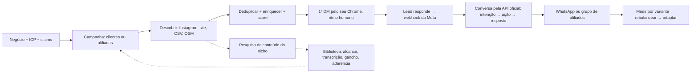

# LeadHunter

**Um SDR que roda na sua máquina: acha quem comprar, fala com cada um pelo seu próprio Instagram, e ainda estuda o que a sua audiência assiste para você saber o que publicar.**

Prospecção terceirizada cobra por lead e fica com a sua base. Ferramenta de disparo em massa queima o seu perfil. O LeadHunter faz o caminho inverso: um banco SQLite no seu disco, o seu Chrome logado mandando a primeira mensagem em ritmo de gente, e cada afirmação que sai checada contra o que você declarou ser verdade.

Roda com `pnpm dev`. Sem servidor, sem conta em plataforma, sem dado saindo da máquina antes de você ligar.

## O que ele resolve, na prática

| A dor | O que o LeadHunter faz |
|---|---|
| "Não sei quem procurar" | Descoberta por Instagram, site, CSV, OpenStreetMap e Google Places, com dedupe entre fontes |
| "Não sei se esse lead presta" | Score 0–100 com confiança separada e evidência citada — dá pra discordar olhando o motivo |
| "Mandar DM na mão não escala; ferramenta de disparo derruba a conta" | Primeira DM pelo **seu** Chrome, 30/dia no teto, 90–240 s entre elas, aquecimento semanal, pausa automática ao primeiro aviso do Instagram |
| "A IA inventa promessa e me processa" | Filtro de afirmações: o que está em "a comprovar" ou "proibido" não sai, nem parafraseado |
| "Respondeu, e agora?" | Webhook da Meta assume o fio, motor de conversa classifica intenção e responde, WhatsApp ou grupo de afiliados no fim |
| "Não sei o que postar pra esse público" | Biblioteca de conteúdo: mapeia as contas do nicho, guarda o que performou, transcreve e pontua a aderência ao seu negócio |

## O ciclo



Cada etapa é um job durável no SQLite: o worker retoma o que ficou no meio depois de reiniciar.

## As telas

| Tela | Para quê |
|---|---|
| **Primeiros passos** (`/onboarding`) | Checklist derivado do banco (sem flag de "concluído" pra desincronizar) e o resumo da base: quantos leads, por status, por canal, por funil, e os últimos que entraram |
| **Leads** (`/leads`) | Filtro por campanha, score, confiança, região, segmento, sinal, fonte e contato |
| **Funil** (`/funil`) | Kanban por tipo, arrastando o estado do lead |
| **Conversas** (`/conversas`) | Linha do tempo por lead: mensagens, decisões da IA, dono do canal |
| **Conteúdo** (`/conteudo`) | Biblioteca do nicho: alcance, gancho, transcrição, aderência, favoritos |
| **Experimentos** (`/experimentos`) | Duas aberturas por funil, métricas por variante, rebalanceamento |
| **Instagram** (`/settings/instagram`) | Estado do Chrome, ritmo do dia, botão de pausa geral |

## Biblioteca de conteúdo

A mesma leitura do nicho que encontra lead responde outra pergunta: **o que essa audiência assiste até o fim?**

Os scripts em [`scripts/insta/`](scripts/insta/README.md) rodam pelo seu Chrome logado (nunca por API privada):

```bash
node scripts/insta/buscar-contas-insta.js "licitação" "pregão"   # quem tem alcance no nicho
node scripts/insta/mapear-reels.js pedraodalicitacao 12          # Reels ranqueados por visualização
node scripts/insta/baixar-reels.js pedraodalicitacao 12          # baixa os melhores
python scripts/insta/transcrever-reels.py pedraodalicitacao      # transcreve local (faster-whisper)
pnpm content:import ./pesquisa                                   # tudo isso vira biblioteca
```

Cada peça entra com alcance, curtidas, comentários, duração, legenda, transcrição e:

- **gancho** — a primeira frase falada, que é o que decide se o vídeo é assistido;
- **aderência (0–100)** — quantos termos do *seu* perfil de negócio aparecem no texto da peça, determinístico e com o motivo escrito ("bateu: licitação, pregão, cnpj");
- **acima da mediana** — alcance da peça dividido pela mediana da conta, que separa "esse conteúdo bombou" de "essa conta é grande".

Estrele o que vale modelar. Mudou o perfil do negócio? "Recalcular aderência" repontua a biblioteca inteira.

## Rodando

```bash
git clone https://github.com/thallisribeiro/leadhunter.git
cd leadhunter
pnpm install
cp .env.example .env        # PowerShell: Copy-Item .env.example .env
pnpm db:migrate
pnpm dev                    # web + worker em http://localhost:3000
```

Sem nenhuma credencial já funciona: onboarding, campanhas, CSV, OpenStreetMap, crawl, score, shortlist, rascunhos, dry-run de DM e e-mail, funil, experimentos e biblioteca de conteúdo.

## Ligando o Instagram, na ordem certa

1. **Chrome dedicado** com porta de debug em `127.0.0.1` (comandos em [SETUP.md](SETUP.md)). Login no Instagram uma vez, na mão.
2. **Dry-run.** `INSTAGRAM_DM_ENABLED=false` (padrão). Rode uma campanha com fonte Instagram: as DMs ficam gravadas em Conversas sem sair.
3. **Piloto.** Revise os textos, ligue `INSTAGRAM_DM_ENABLED=true`. O aquecimento começa em 5 por dia.
4. **API oficial.** App da Meta com webhook em `/api/webhooks/instagram`, `INSTAGRAM_APP_SECRET`, `INSTAGRAM_PAGE_ACCESS_TOKEN`, `INSTAGRAM_WEBHOOK_VERIFY_TOKEN`.
5. **Autonomia.** `AUTOPILOT_ENABLED=true`.

Para desligar tudo agora: botão "Pausar tudo" em Instagram, ou `AUTOPILOT_ENABLED=false` + `INSTAGRAM_DM_ENABLED=false` e reiniciar.

## Como cada parte funciona

**Descoberta.** Instagram (busca por palavra-chave e páginas de hashtag, lendo só perfis públicos), sites informados, CSV com mapeamento de colunas, OpenStreetMap/Overpass e Google Places (opcional). Um lead só; várias fontes ficam registradas nele. Dedupe por handle, domínio, e-mail, telefone, URL e nome+cidade.

**Qualificação.** Score 0–100 e confiança separada, com explicação auditável. Do perfil do Instagram entram bio, números e sinais (WhatsApp na bio, site no perfil, vende pelo direct) e quem responde: dono, loja ou funcionário. Se o perfil tem site, o crawler entra e a evidência do site soma.

**Primeiro contato pelo navegador.** Playwright conectado ao seu Chrome por CDP: perfil dedicado, sessão logada por você, aba própria do agente, nunca rouba foco, só `instagram.com`, fecha a aba mesmo em erro, guarda screenshot e snapshot de acessibilidade quando falha. Nada de fingerprint forjado, API privada ou contorno de restrição — um alerta do Instagram **pausa tudo**.

**Continuação pela API oficial.** O webhook da Meta recebe a resposta, o sistema casa o IGSID com o lead e a propriedade do canal passa para a API. A partir daí o navegador nunca mais responde aquele fio, e a API só envia com janela de 24 h aberta.

**Motor de conversa.** Intenções (`interested`, `asked_pricing`, `wants_whatsapp`, `not_the_owner`, `opt_out`…) → ações → resposta. Funciona sem IA, com regras; com um endpoint compatível com OpenAI, classifica e redige — sempre atrás do filtro de afirmações. Pedido de parar é atendido na hora, para sempre, em todos os canais.

**Dois funis.** Clientes vão para o link do WhatsApp; criadores vão para o grupo de afiliados. Pipeline e estado de canal são campos separados.

**Experimentos.** Duas variantes de abertura por funil, sorteio por peso, atribuição fixa por lead, métricas por variante e rebalanceamento automático com piso de exploração de 20%, só depois de 30 envios por variante.

**Autopilot.** A cada 5 minutos: descobre se está abaixo da meta, manda uma DM se o ritmo permite, agenda follow-ups, rebalanceia uma vez por dia. Respeita pausa, limites e janela de operação. Desligado por padrão.

**Segurança.** Segredos só no `.env`; perfil do Chrome e banco fora do Git; assinatura do webhook verificada; idempotência de webhook e job; retry com limite e dead-letter; orçamento mensal de IA que pausa a IA; circuit breaker de 3 falhas do navegador; pausa manual e automática.

## Demonstração offline

```bash
pnpm db:seed
LEADHUNTER_FIXTURE_MODE=true pnpm dev
```

Em modo fixture o "Instagram" é uma simulação em memória (`src/integrations/browser/fake.ts`): descoberta, score, mensagem de abertura, dry-run e funil rodam de ponta a ponta sem tocar em conta nenhuma.

## Comandos

| Comando | O que faz |
|---|---|
| `pnpm dev` / `pnpm start` | web + worker |
| `pnpm db:migrate` | aplica as migrações (idempotente) |
| `pnpm db:seed` | demo com 20 clínicas fictícias |
| `pnpm db:backup` | backup consistente em `backups/` |
| `pnpm content:import <pasta>` | importa a pesquisa de conteúdo para a biblioteca |
| `pnpm lint` · `pnpm typecheck` · `pnpm test` | qualidade |
| `pnpm test:e2e` | build + fluxo completo no navegador |
| `pnpm smoke:real` | Overpass e uma URL pública de verdade |

## Arquitetura

```text
src/
  app/                 painel PT-BR, Server Actions, webhook da Meta
  features/
    business/          perfil, ICP, claims (bloco CONFIGURAÇÃO)
    onboarding/        checklist derivado do banco + resumo da base
    campaigns/         campanha por funil, fontes, hashtags, autopilot
    discovery/         provedores + dedupe + snapshot do Instagram
    enrichment/        crawler limitado + evidência citada
    scoring/           score determinístico + confiança
    instagram/         ritmo/aquecimento, 1ª DM, autopilot
    conversations/     trava de canal, mensagens, motor de conversa
    content/           biblioteca do nicho: peças, gancho, aderência
    experiments/       variantes, atribuição, métricas, rebalanceamento
    ops/               pausa geral, circuit breaker, exceções
    outreach/          e-mail (dry-run), supressão, exportação
  integrations/
    browser/           Playwright por CDP no seu Chrome + parser + fake
    instagram/         API oficial da Meta (assinatura, webhook, envio)
    llm/               cliente compatível com OpenAI, orçamento, conversa
    whatsapp/          fila em arquivo para um listener externo
    discovery/, web/, smtp/
  db/                  schema Drizzle, migrações SQL, seed, importadores
  worker/              fila durável + jobs + tick do autopilot
scripts/insta/         pesquisa e prospecção pelo Chrome logado (CDP)
```

## Limites que continuam de propósito

- Single-user, local. Sem multi-tenant, sem billing.
- A primeira DM exige o seu Chrome logado; em container ou nuvem o navegador não existe, então a camada roda em dry-run e simulação.
- A API da Meta não abre conversa com quem nunca respondeu e fecha a janela em 24 h; o sistema registra e não contorna pelo navegador.
- O DOM do Instagram muda. O parser lê meta tags públicas (mais estáveis) e o clique usa papéis de acessibilidade; 3 falhas seguidas pausam e a fila de exceções mostra o artefato.
- A biblioteca de conteúdo guarda métrica **do dia da leitura**: é referência de formato, não série histórica.
- Conformidade legal e base legítima para contato continuam sendo do operador.

## Documentação

- [Setup, Chrome, Meta, operação e troubleshooting](SETUP.md)
- [Scripts de pesquisa no Instagram](scripts/insta/README.md)
- [Plano da versão com Instagram](docs/superpowers/plans/2026-09-05-buscando-potencializado.md)
- [Especificação do MVP anterior (só web)](docs/superpowers/specs/2026-09-05-leadhunter-local-design.md)
- [Referência de origem: prompt "Buscando 1 Milhão"](docs/reference/buscandomilhao.md)
